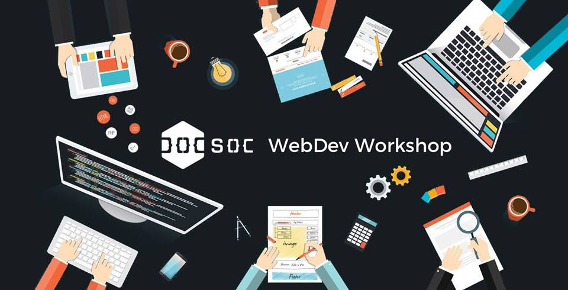

# DoCSoc WebDev Workshop 2017

The course will teach industry standards and give you a wide range of skills that will be applicable to Topics in first year, Web apps in second year, hackathons, and beyond into your career.

There are no prerequisites for this course - just bring a laptop and yourself. We'll start with basic HTML, CSS, and Javascript in the first week, then move onto advanced topics such as databases, deployment, maintenance, and security.

This workshop is designed as a whole 10-week course, and will be held every Thursday at 6pm. Video and source code will be uploaded to this page shortly after each session.

Join the [Facebook group](https://www.facebook.com/groups/1770637513199253/) to receive the latest updates.

> The next session will be on **Thursday 19th of January at 6pm in room 145, Huxley building**.

## Past sessions

||||||
|--------|------------|---------------------|-----------------------|-------------------|
| Week 0, Part 1 | HTML | [Watch][w0p1watch] | Soon | Soon |
| Week 0, Part 2 | CSS | [Watch][w0p2watch] | [Source][w0p2source] | [Demo][w0p2demo] |

## About
The WebDev workshops are organised by [DoCSoc](http://docsoc.co.uk), Imperial's Computing Society.

[w0p1watch]: https://imperial.cloud.panopto.eu/Panopto/Pages/Viewer.aspx?id=17d7f514-a716-441a-ac42-ce6bbd5bf7c7
[w0p1source]: week0/part1-html
[w0p1demo]: http://webdev.docsoc.co.uk/week0/part1-html/
[w0p2watch]: https://imperial.cloud.panopto.eu/Panopto/Pages/Viewer.aspx?id=17d7f514-a716-441a-ac42-ce6bbd5bf7c7
[w0p2source]: week0/part2-css
[w0p2demo]: http://webdev.docsoc.co.uk/week0/part2-css/